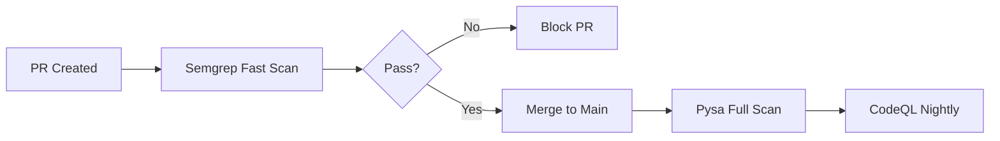

# Benchmarks

This section documents our methodology for evaluating taint analysis tools and presents comparative results.

## Purpose

Benchmarks help you:

1. **Choose the right tool** for your needs
2. **Understand trade-offs** between speed and accuracy
3. **Validate detection** against known vulnerabilities
4. **Track improvements** over time

## Benchmark Components

<div class="grid cards" markdown>

-   :material-clipboard-list:{ .lg .middle } **Methodology**

    ---

    How we measure and compare tools

    [:octicons-arrow-right-24: Methodology](methodology.md)

-   :material-chart-bar:{ .lg .middle } **Results**

    ---

    Comparative analysis results

    [:octicons-arrow-right-24: Results](results.md)

-   :material-bug:{ .lg .middle } **CVE Analysis**

    ---

    Real-world vulnerability reproductions

    [:octicons-arrow-right-24: CVE Analysis](cve-analysis.md)

-   :material-play:{ .lg .middle } **Running Benchmarks**

    ---

    Execute benchmarks yourself

    [:octicons-arrow-right-24: Run Benchmarks](running.md)

</div>

## Quick Results

### Detection Rate

| Tool | VulnShop (16 vulns) | Detection Rate |
|------|---------------------|----------------|
| CodeQL | 14/16 | 87.5% |
| Pysa | 12/16 | 75.0% |
| Semgrep | 11/16 | 68.75% |

### Execution Time

| Tool | VulnShop | Large Codebase |
|------|----------|----------------|
| Semgrep | ~5s | ~30s |
| Pysa | ~45s | ~5min |
| CodeQL | ~2min | ~15min |

### Trade-off Matrix

```
Detection Rate
     ↑
     │  ★ CodeQL
     │     ★ Pysa
     │        ★ Semgrep
     └────────────────→ Speed
```

## Key Findings

1. **CodeQL** achieves highest accuracy but slowest execution
2. **Semgrep** provides fastest feedback with good detection
3. **Pysa** balances depth and speed for Python projects
4. **Combined approach** catches the most vulnerabilities

## Recommended Strategy



## Running Your Own Benchmarks

```bash
cd benchmarks
python scripts/run_benchmarks.py --tools all
python scripts/generate_report.py --format html
```

See [Running Benchmarks](running.md) for detailed instructions.
