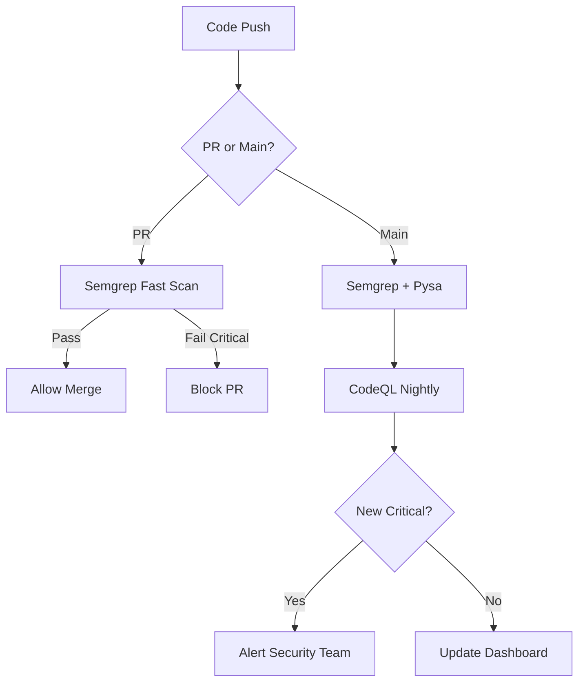

# CI/CD Integration

This guide covers integrating Pysa, CodeQL, and Semgrep into various CI/CD platforms.

## Strategy Overview

### Tiered Approach

| Tier | Tool | Trigger | Blocking | Time |
|------|------|---------|:--------:|------|
| 1 | Semgrep | Every PR | ✅ | ~30s |
| 2 | Pysa | Main branch | ⚠️ | ~2min |
| 3 | CodeQL | Release | ⚠️ | ~5min |

### Decision Flow



## GitHub Actions

### Complete Workflow

```yaml
# .github/workflows/security-analysis.yml
name: Security Analysis

on:
  push:
    branches: [main, develop]
  pull_request:
    branches: [main]
  schedule:
    - cron: '0 2 * * *'  # Nightly at 2 AM

jobs:
  # Fast check on every PR
  semgrep:
    name: Semgrep Scan
    runs-on: ubuntu-latest
    if: github.event_name == 'pull_request'
    steps:
      - uses: actions/checkout@v4

      - name: Run Semgrep
        uses: returntocorp/semgrep-action@v1
        with:
          config: >-
            p/security-audit
            p/python
            p/django
          generateSarif: true

      - name: Upload SARIF
        uses: github/codeql-action/upload-sarif@v3
        with:
          sarif_file: semgrep.sarif
        if: always()

  # Deep analysis on main branch
  pysa:
    name: Pysa Analysis
    runs-on: ubuntu-latest
    if: github.ref == 'refs/heads/main'
    steps:
      - uses: actions/checkout@v4

      - name: Set up Python
        uses: actions/setup-python@v5
        with:
          python-version: '3.10'

      - name: Install dependencies
        run: |
          pip install pyre-check
          pip install -r requirements.txt

      - name: Run Pysa
        run: |
          cd analysis/pysa
          pyre analyze --output-format sarif \
            --save-results-to results/

      - name: Upload SARIF
        uses: github/codeql-action/upload-sarif@v3
        with:
          sarif_file: analysis/pysa/results/results.sarif

  # Comprehensive analysis nightly
  codeql:
    name: CodeQL Analysis
    runs-on: ubuntu-latest
    if: github.event_name == 'schedule' || github.ref == 'refs/heads/main'
    permissions:
      security-events: write
    steps:
      - uses: actions/checkout@v4

      - name: Initialize CodeQL
        uses: github/codeql-action/init@v3
        with:
          languages: python
          config-file: .github/codeql/codeql-config.yml

      - name: Autobuild
        uses: github/codeql-action/autobuild@v3

      - name: Perform CodeQL Analysis
        uses: github/codeql-action/analyze@v3
        with:
          category: "/language:python"
```

### CodeQL Configuration

```yaml
# .github/codeql/codeql-config.yml
name: "Custom CodeQL Configuration"

queries:
  - uses: security-and-quality
  - uses: security-extended
  - uses: ./analysis/codeql/queries

paths-ignore:
  - "**/test/**"
  - "**/tests/**"
  - "**/*_test.py"
  - "**/migrations/**"

query-filters:
  - exclude:
      problem.severity: recommendation
```

## GitLab CI

```yaml
# .gitlab-ci.yml
stages:
  - test
  - security
  - report

variables:
  SEMGREP_RULES: "p/security-audit p/python"

semgrep:
  stage: security
  image: returntocorp/semgrep
  script:
    - semgrep ci --config "${SEMGREP_RULES}"
  rules:
    - if: $CI_PIPELINE_SOURCE == "merge_request_event"
  artifacts:
    reports:
      sast: semgrep.sarif

pysa:
  stage: security
  image: python:3.10
  script:
    - pip install pyre-check
    - cd analysis/pysa && pyre analyze --output-format sarif
  rules:
    - if: $CI_COMMIT_BRANCH == "main"
  artifacts:
    paths:
      - analysis/pysa/results/
    reports:
      sast: analysis/pysa/results/results.sarif

codeql:
  stage: security
  image: ghcr.io/github/codeql-action/codeql-bundle-linux
  script:
    - codeql database create db --language=python
    - codeql database analyze db --format=sarif-latest --output=results.sarif
  rules:
    - if: $CI_PIPELINE_SOURCE == "schedule"
  artifacts:
    reports:
      sast: results.sarif
```

## Jenkins

### Jenkinsfile

```groovy
pipeline {
    agent any

    environment {
        SEMGREP_RULES = 'p/security-audit p/python'
    }

    stages {
        stage('Checkout') {
            steps {
                checkout scm
            }
        }

        stage('Semgrep') {
            when {
                changeRequest()
            }
            steps {
                sh '''
                    docker run --rm -v "${WORKSPACE}:/src" \
                        returntocorp/semgrep semgrep \
                        --config "${SEMGREP_RULES}" \
                        --sarif --output semgrep.sarif \
                        /src
                '''
            }
            post {
                always {
                    recordIssues(
                        tools: [sarif(pattern: 'semgrep.sarif')]
                    )
                }
            }
        }

        stage('Pysa') {
            when {
                branch 'main'
            }
            steps {
                sh '''
                    pip install pyre-check
                    cd analysis/pysa
                    pyre analyze --output-format sarif \
                        --save-results-to results/
                '''
            }
            post {
                always {
                    recordIssues(
                        tools: [sarif(pattern: 'analysis/pysa/results/*.sarif')]
                    )
                }
            }
        }

        stage('CodeQL') {
            when {
                anyOf {
                    branch 'main'
                    triggeredBy 'TimerTrigger'
                }
            }
            steps {
                sh '''
                    codeql database create codeql-db --language=python
                    codeql database analyze codeql-db \
                        --format=sarif-latest \
                        --output=codeql-results.sarif \
                        analysis/codeql/suites/vulnshop-security.qls
                '''
            }
            post {
                always {
                    recordIssues(
                        tools: [sarif(pattern: 'codeql-results.sarif')]
                    )
                }
            }
        }
    }

    post {
        failure {
            emailext(
                subject: "Security Analysis Failed: ${env.JOB_NAME}",
                body: "Check console output at ${env.BUILD_URL}",
                to: 'security@company.com'
            )
        }
    }
}
```

## Azure DevOps

```yaml
# azure-pipelines.yml
trigger:
  branches:
    include:
      - main
      - develop

pr:
  branches:
    include:
      - main

schedules:
  - cron: "0 2 * * *"
    displayName: Nightly security scan
    branches:
      include:
        - main

stages:
  - stage: Security
    jobs:
      - job: Semgrep
        condition: eq(variables['Build.Reason'], 'PullRequest')
        pool:
          vmImage: 'ubuntu-latest'
        steps:
          - task: UsePythonVersion@0
            inputs:
              versionSpec: '3.10'

          - script: pip install semgrep
            displayName: 'Install Semgrep'

          - script: |
              semgrep --config "p/security-audit" \
                --config "p/python" \
                --sarif --output $(Build.ArtifactStagingDirectory)/semgrep.sarif
            displayName: 'Run Semgrep'

          - task: PublishBuildArtifacts@1
            inputs:
              pathToPublish: '$(Build.ArtifactStagingDirectory)/semgrep.sarif'
              artifactName: 'SecurityResults'

      - job: CodeQL
        condition: or(eq(variables['Build.Reason'], 'Schedule'), eq(variables['Build.SourceBranch'], 'refs/heads/main'))
        pool:
          vmImage: 'ubuntu-latest'
        steps:
          - task: AdvancedSecurity-Codeql-Init@1
            inputs:
              languages: 'python'

          - task: AdvancedSecurity-Codeql-Autobuild@1

          - task: AdvancedSecurity-Codeql-Analyze@1
```

## Blocking Rules

### Severity-Based Blocking

```yaml
# Semgrep - block on ERROR severity
- name: Run Semgrep
  run: |
    semgrep --config rules/ \
      --error \
      --severity ERROR \
      src/

# Exit code 1 if ERROR findings exist
```

### Critical Rule Blocking

```yaml
# Block specific critical vulnerabilities
- name: Check Critical Vulnerabilities
  run: |
    semgrep --config rules/ --json src/ > results.json

    # Check for SQL injection
    SQL_COUNT=$(jq '[.results[] | select(.check_id | contains("sql-injection"))] | length' results.json)
    if [ "$SQL_COUNT" -gt 0 ]; then
      echo "::error::SQL Injection detected!"
      exit 1
    fi

    # Check for command injection
    CMD_COUNT=$(jq '[.results[] | select(.check_id | contains("command-injection"))] | length' results.json)
    if [ "$CMD_COUNT" -gt 0 ]; then
      echo "::error::Command Injection detected!"
      exit 1
    fi
```

## Notifications

### Slack Integration

```yaml
- name: Notify Slack on Failure
  if: failure()
  uses: 8398a7/action-slack@v3
  with:
    status: failure
    fields: repo,message,commit,author,action,eventName,ref
    text: ':warning: Security scan found critical issues!'
  env:
    SLACK_WEBHOOK_URL: ${{ secrets.SLACK_WEBHOOK }}
```

### Email Alerts

```yaml
- name: Send Email Alert
  if: failure()
  uses: dawidd6/action-send-mail@v3
  with:
    server_address: smtp.company.com
    server_port: 587
    username: ${{ secrets.EMAIL_USER }}
    password: ${{ secrets.EMAIL_PASS }}
    subject: "Security Alert: ${{ github.repository }}"
    body: |
      Security analysis found critical vulnerabilities.
      Repository: ${{ github.repository }}
      Branch: ${{ github.ref }}
      Commit: ${{ github.sha }}
    to: security@company.com
```

## Best Practices

1. **Start non-blocking** - Gather data before enforcing
2. **Clear failure messages** - Help developers fix issues
3. **Cache dependencies** - Speed up analysis
4. **Parallel execution** - Run tools concurrently
5. **Artifact storage** - Keep results for trending
6. **Incremental adoption** - Roll out gradually
