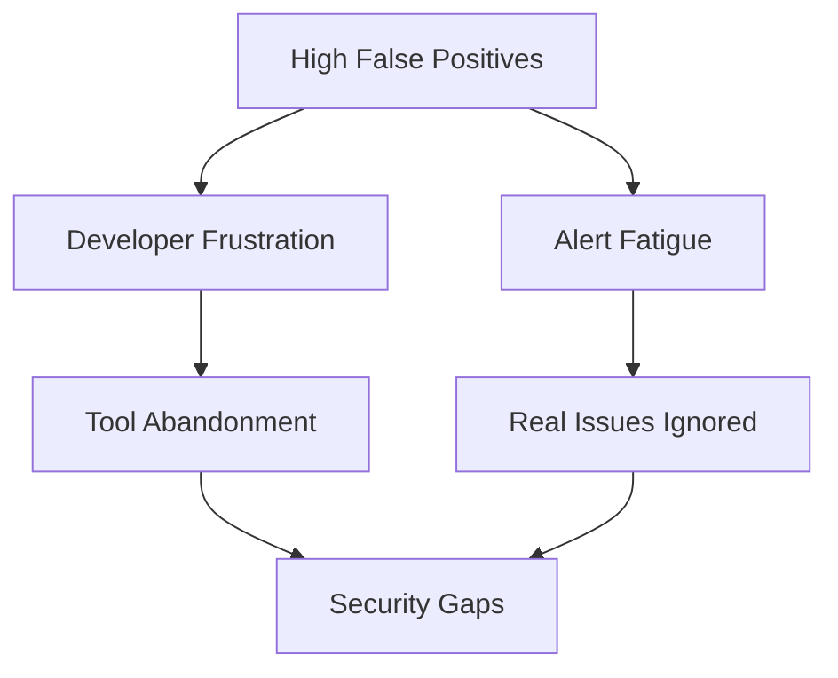
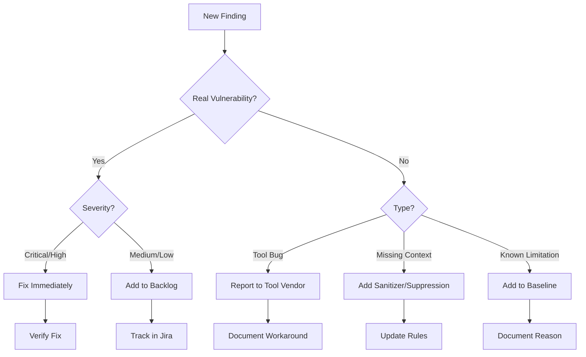

# False Positive Management

False positives are the biggest challenge in static analysis adoption. This guide covers strategies to minimize noise and maximize signal.

## Understanding False Positives

### Types of False Positives

| Type | Description | Example |
|------|-------------|---------|
| **True FP** | Tool incorrectly flags safe code | Flagging parameterized query as SQLi |
| **Contextual FP** | Finding is valid but not exploitable | Admin-only function with injection |
| **Intentional** | Developer knows and accepts risk | Eval used for configuration |
| **Legacy** | Known issue, planned for later | Technical debt |

### Impact of False Positives



## Baseline Management

### Creating a Baseline

```python
#!/usr/bin/env python3
"""Create baseline from current results."""

import json
import hashlib
from pathlib import Path

def create_baseline(results_file: Path, baseline_file: Path):
    with open(results_file) as f:
        results = json.load(f)

    baseline = []
    for result in results.get('results', []):
        # Create unique identifier for each finding
        fingerprint = hashlib.sha256(
            f"{result['path']}:{result['start']['line']}:{result['check_id']}".encode()
        ).hexdigest()[:16]

        baseline.append({
            'fingerprint': fingerprint,
            'check_id': result['check_id'],
            'path': result['path'],
            'line': result['start']['line'],
            'reason': 'legacy',  # Update with actual reason
            'created': '2024-01-15'
        })

    with open(baseline_file, 'w') as f:
        json.dump({'findings': baseline}, f, indent=2)

    print(f"Created baseline with {len(baseline)} findings")
```

### Filtering Baseline

```python
def filter_baseline(results_file: Path, baseline_file: Path) -> dict:
    with open(results_file) as f:
        results = json.load(f)
    with open(baseline_file) as f:
        baseline = json.load(f)

    baseline_fps = {f['fingerprint'] for f in baseline['findings']}

    new_results = []
    baselined = 0

    for result in results.get('results', []):
        fingerprint = hashlib.sha256(
            f"{result['path']}:{result['start']['line']}:{result['check_id']}".encode()
        ).hexdigest()[:16]

        if fingerprint in baseline_fps:
            baselined += 1
        else:
            new_results.append(result)

    print(f"Total: {len(results.get('results', []))}")
    print(f"Baselined: {baselined}")
    print(f"New: {len(new_results)}")

    return {'results': new_results}
```

## Inline Suppressions

### Semgrep

```python
# nosemgrep: sql-injection-format-string
cursor.execute(f"SELECT * FROM {table_name}")  # Table name from config, not user input

# nosemgrep
def intentionally_vulnerable_for_testing():
    eval(user_input)  # Used only in test environment
```

### CodeQL

```python
# lgtm[py/sql-injection]
cursor.execute(query)  # Query is from trusted configuration
```

### Pysa

Create suppression in `.pyre_configuration`:

```json
{
  "source_directories": ["."],
  "taint_models_path": ["models"],
  "ignore_all_errors": [
    "tests/*",
    "legacy_module/*"
  ]
}
```

## Rule Tuning

### Semgrep Rule Refinement

**Before (noisy):**
```yaml
rules:
  - id: sql-injection
    pattern: cursor.execute($QUERY)
    message: Potential SQL injection
    severity: ERROR
```

**After (precise):**
```yaml
rules:
  - id: sql-injection
    patterns:
      - pattern: cursor.execute($QUERY)
      # Exclude parameterized queries
      - pattern-not: cursor.execute($QUERY, $PARAMS)
      # Exclude constant queries
      - pattern-not: cursor.execute("...")
      # Must be in a view function
      - pattern-inside: |
          def $FUNC(request, ...):
            ...
    message: SQL injection via string formatting
    severity: ERROR
```

### CodeQL Query Refinement

```ql
class SqlInjectionConfig extends TaintTracking::Configuration {
  override predicate isSanitizer(DataFlow::Node node) {
    // Integer conversion
    exists(Call call |
      call.getFunc().(Name).getId() in ["int", "float"] and
      node.asExpr() = call
    )
    or
    // Custom sanitizer functions
    exists(Call call |
      call.getFunc().(Name).getId() in [
        "sanitize_input",
        "validate_id",
        "escape_sql"
      ] and
      node.asExpr() = call
    )
    or
    // Allowlisted values
    exists(Compare cmp |
      cmp.getOp(0) instanceof In and
      node.asExpr() = cmp.getComparator(0)
    )
  }
}
```

### Pysa Model Refinement

```python
# models/sanitizers.pysa

# Custom validation functions
def myapp.utils.validate_user_id(
    user_id: TaintInTaintOut[LocalReturn, NoTaint]
) -> int: ...

def myapp.utils.sanitize_query(
    query: Sanitize[TaintSink[SQL]]
) -> str: ...

# Framework-specific sanitizers
def django.core.validators.validate_email(
    value: TaintInTaintOut[LocalReturn, NoTaint]
): ...
```

## Categorization Workflow

### Triage Process



### Triage Template

```yaml
# Finding triage record
finding_id: "semgrep-sql-injection-001"
file: "catalog/views.py"
line: 42
rule: "sql-injection-format-string"
severity: ERROR

triage:
  status: false_positive  # true_positive, false_positive, wont_fix
  reason: "Table name from configuration, not user input"
  triaged_by: "security-team"
  triaged_date: "2024-01-15"

action:
  type: suppress  # fix, suppress, accept_risk, defer
  details: "Added nosemgrep comment with explanation"
```

## Metrics and Reporting

### Track False Positive Rate

```python
def calculate_fp_rate(results_file: Path, triage_file: Path) -> dict:
    with open(results_file) as f:
        results = json.load(f)
    with open(triage_file) as f:
        triage = json.load(f)

    total = len(results.get('results', []))
    triaged = {t['finding_id']: t for t in triage.get('findings', [])}

    true_positives = sum(1 for t in triaged.values() if t['status'] == 'true_positive')
    false_positives = sum(1 for t in triaged.values() if t['status'] == 'false_positive')

    return {
        'total_findings': total,
        'triaged': len(triaged),
        'true_positives': true_positives,
        'false_positives': false_positives,
        'fp_rate': false_positives / len(triaged) if triaged else 0,
        'precision': true_positives / len(triaged) if triaged else 0
    }
```

### Dashboard Metrics

| Metric | Formula | Target |
|--------|---------|--------|
| Precision | TP / (TP + FP) | >80% |
| Recall | TP / (TP + FN) | >70% |
| FP Rate | FP / Total Findings | <20% |
| Mean Time to Triage | Avg(triage_date - finding_date) | <2 days |

## Best Practices

### 1. Document All Suppressions

```python
# BAD: No explanation
# nosemgrep

# GOOD: Clear justification
# nosemgrep: sql-injection-format-string
# Reason: column_name is from ALLOWED_COLUMNS constant, validated on L45
# Reviewed by: @security-team on 2024-01-15
# Ticket: SEC-1234
```

### 2. Regular Baseline Review

```yaml
# Quarterly baseline review checklist
- [ ] Review all suppressed findings
- [ ] Remove fixed findings from baseline
- [ ] Verify suppression reasons still valid
- [ ] Update tool versions and re-scan
- [ ] Document any new patterns found
```

### 3. Feedback Loop with Developers

```markdown
## Weekly Security Analysis Summary

**New Findings:** 5
**Fixed This Week:** 12
**False Positives Reported:** 3

### Top False Positive Patterns
1. Parameter validation not recognized (2 reports)
2. Test file incorrectly flagged (1 report)

### Action Items
- [ ] Add sanitizer for `validate_params()` function
- [ ] Exclude `tests/` directory from scan
```

### 4. Continuous Improvement

Track and fix common FP sources:

```python
# fp_tracker.py
FP_PATTERNS = {
    'validate_params_not_recognized': {
        'count': 15,
        'action': 'Add sanitizer model',
        'status': 'in_progress',
        'ticket': 'SEC-456'
    },
    'test_files_flagged': {
        'count': 8,
        'action': 'Update exclude patterns',
        'status': 'completed',
        'ticket': 'SEC-123'
    }
}
```

## Tool-Specific Tips

### Semgrep
- Use `pattern-not` to exclude known safe patterns
- Leverage `metavariable-comparison` for value validation
- Add framework-specific exclusions

### CodeQL
- Define custom sanitizer predicates
- Use `pragma[noopt]` for expensive queries
- Create organization-specific libraries

### Pysa
- Add sanitizer models for validation functions
- Use `ignore_all_errors` sparingly
- Keep models in sync with codebase
