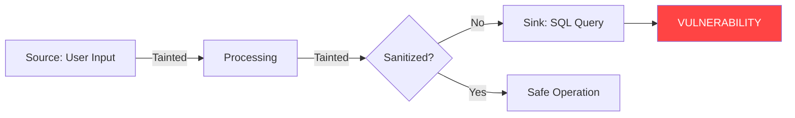

# Taint Analysis Masterclass

Welcome to **Taint Analysis Masterclass**, a comprehensive reference for security engineers demonstrating expertise in static application security testing (SAST) through taint analysis.

## What is Taint Analysis?

**Taint analysis** tracks the flow of untrusted data through an application to identify security vulnerabilities. When data from an untrusted source (like user input) reaches a security-sensitive operation (a sink) without proper sanitization, a vulnerability exists.



## Project Highlights

<div class="grid cards" markdown>

-   :material-shield-bug:{ .lg .middle } **16+ Real Vulnerabilities**

    ---

    VulnShop contains realistic, exploitable vulnerabilities covering the entire OWASP Top 10.

    [:octicons-arrow-right-24: Explore VulnShop](vulnshop/index.md)

-   :material-tools:{ .lg .middle } **3 Industry Tools**

    ---

    Complete configurations for Pysa (Meta), CodeQL (GitHub), and Semgrep.

    [:octicons-arrow-right-24: Compare Tools](tools/index.md)

-   :material-chart-bar:{ .lg .middle } **Rigorous Benchmarks**

    ---

    Quantitative comparison with Precision, Recall, and F1 metrics.

    [:octicons-arrow-right-24: View Results](benchmarks/index.md)

-   :material-factory:{ .lg .middle } **Enterprise Ready**

    ---

    CI/CD integration, false positive management, and scaling guidance.

    [:octicons-arrow-right-24: Enterprise Guide](enterprise/index.md)

</div>

## Quick Start

Get up and running in 5 minutes:

```bash
# Clone the repository
git clone https://github.com/laugiov/code-safety.git
cd taint-analysis-masterclass

# Start everything
docker-compose up -d

# Run all analyses
make analyze-all
```

[:octicons-arrow-right-24: Full Installation Guide](getting-started/installation.md)

## Tool Comparison

| Feature | Pysa | CodeQL | Semgrep |
|---------|:----:|:------:|:-------:|
| **Developer** | Meta | GitHub | Semgrep Inc. |
| **Analysis Type** | Taint Tracking | Semantic | Pattern Matching |
| **Learning Curve** | High | High | Medium |
| **Speed** | Medium | Slow | Fast |
| **Precision** | High | Very High | Medium |

[:octicons-arrow-right-24: Detailed Comparison](tools/index.md)

## Who Is This For?

| Audience | Benefit |
|----------|---------|
| **Security Engineers** | Production-ready reference implementation |
| **Developers** | Learn secure coding and understand vulnerabilities |
| **Hiring Managers** | Evaluate candidate security skills |
| **Students** | Comprehensive learning resource |

## Documentation Structure

- **[Getting Started](getting-started/index.md)** - Installation and quick start
- **[Theory](theory/index.md)** - Taint analysis concepts and fundamentals
- **[Tools](tools/index.md)** - Guides for Pysa, CodeQL, and Semgrep
- **[Vulnerabilities](vulnerabilities/index.md)** - Deep dives into each vulnerability type
- **[Enterprise](enterprise/index.md)** - CI/CD integration and scaling
- **[Benchmarks](benchmarks/index.md)** - Tool comparison and metrics

## License

This project is licensed under the MIT License.

!!! warning "Security Notice"
    This repository contains **intentionally vulnerable code** for educational purposes.
    VulnShop should **NEVER** be deployed to production or exposed to the internet.
