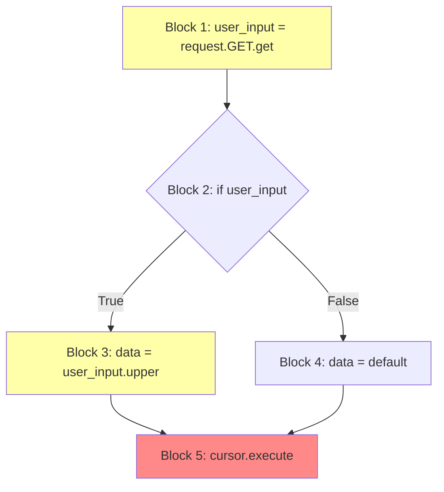

# Dataflow Analysis

Dataflow analysis is the foundation of taint tracking. This page explains how analysis tools follow data as it moves through your program.

## What is Dataflow Analysis?

**Dataflow analysis** is a technique for computing information about the flow of data in a program. For security, we're interested in tracking where data comes from and where it goes.

## Types of Dataflow

### Forward Dataflow

Tracks data from sources toward sinks (the direction taint naturally flows).

```python
# Forward flow: username → query → execute
username = request.GET.get('user')  # Source
query = f"SELECT * FROM users WHERE name = '{username}'"  # Propagation
cursor.execute(query)  # Sink
```

### Backward Dataflow

Starts from sinks and works backward to find sources.

```python
# Backward analysis starting from cursor.execute()
# What data reaches this sink?
cursor.execute(query)  # Start here
    ↑
query = f"SELECT ... {username}"  # Where does query come from?
    ↑
username = request.GET.get('user')  # Found the source!
```

## Control Flow Graph (CFG)

Tools build a Control Flow Graph to understand possible execution paths.

```python
def process(request):
    user_input = request.GET.get('x')  # Block 1

    if user_input:                      # Block 2 (condition)
        data = user_input.upper()       # Block 3 (true branch)
    else:
        data = "default"                # Block 4 (false branch)

    cursor.execute(f"SELECT {data}")    # Block 5 (merge point)
```



At Block 5, data might be tainted (from Block 3) or safe (from Block 4). Conservative analysis treats it as **potentially tainted**.

## Intra-procedural vs Inter-procedural

### Intra-procedural Analysis

Analyzes one function at a time.

```python
def vulnerable(request):
    # All within one function
    user_input = request.GET.get('x')
    query = "SELECT * FROM t WHERE id = " + user_input
    cursor.execute(query)  # Detected
```

**Fast but limited** - misses cross-function flows.

### Inter-procedural Analysis

Tracks data across function calls.

```python
def get_input(request):
    return request.GET.get('x')  # Source

def build_query(value):
    return f"SELECT * FROM t WHERE id = {value}"  # Propagation

def execute_query(query):
    cursor.execute(query)  # Sink

def view(request):
    user_input = get_input(request)   # Call 1
    query = build_query(user_input)    # Call 2
    execute_query(query)               # Call 3 - Still detected!
```

**More accurate but slower** - requires analyzing call relationships.

## Context Sensitivity

### Context-Insensitive

Same analysis for all call sites:

```python
def process(data):
    return data.upper()

result1 = process(request.GET.get('x'))  # Tainted
result2 = process("safe_string")          # Safe

# Context-insensitive: Both results marked potentially tainted
```

### Context-Sensitive

Distinguishes between call sites:

```python
# Context-sensitive analysis tracks:
# - process(request.GET.get('x')) → returns tainted
# - process("safe_string") → returns clean

result1 = process(request.GET.get('x'))  # Correctly: Tainted
result2 = process("safe_string")          # Correctly: Safe
```

## Taint Propagation Rules

### String Operations

```python
tainted = request.GET.get('x')

# Concatenation: propagates taint
result = "prefix" + tainted + "suffix"  # Tainted

# F-strings: propagates taint
result = f"value: {tainted}"  # Tainted

# Format: propagates taint
result = "value: {}".format(tainted)  # Tainted

# Join: taint propagates
result = ",".join([tainted, "safe"])  # Tainted
```

### Collection Operations

```python
tainted = request.GET.get('x')

# List: element is tainted
my_list = [tainted]
my_list[0]  # Tainted

# Dict: value is tainted
my_dict = {'key': tainted}
my_dict['key']  # Tainted
my_dict.get('key')  # Tainted

# Tuple unpacking
a, b = (tainted, "safe")
a  # Tainted
b  # Safe (precise analysis) or Tainted (conservative)
```

### Function Returns

```python
def identity(x):
    return x  # Return propagates taint

def transform(x):
    return x.upper()  # Still propagates taint

def sanitize(x):
    return int(x)  # May remove taint (type conversion)
```

## Abstract Interpretation

Tools use abstract values to approximate runtime behavior:

| Abstract Value | Meaning |
|----------------|---------|
| `Tainted` | Data from untrusted source |
| `Clean` | Definitely safe data |
| `Unknown` | Could be either |

### Meet Operation (∧)

When paths merge:

```
Tainted ∧ Clean = Tainted  (conservative)
Tainted ∧ Tainted = Tainted
Clean ∧ Clean = Clean
```

### Example

```python
if condition:
    x = request.GET.get('input')  # Tainted
else:
    x = "safe"                     # Clean

# After merge: x is Tainted (conservative)
cursor.execute(f"SELECT {x}")  # ALERT
```

## Field Sensitivity

Tracking taint through object fields:

```python
class User:
    def __init__(self):
        self.name = None
        self.id = None

user = User()
user.name = request.GET.get('name')  # Tainted field
user.id = 42                          # Clean field

# Field-sensitive analysis:
cursor.execute(f"SELECT * WHERE name = {user.name}")  # ALERT: user.name tainted
cursor.execute(f"SELECT * WHERE id = {user.id}")     # Safe: user.id clean

# Field-insensitive analysis:
# Entire user object marked tainted - more false positives
```

## Challenges

### Aliasing

```python
x = request.GET.get('input')
y = x  # Alias
z = y  # Another alias

# All three refer to same tainted data
cursor.execute(z)  # Must be detected
```

### Dynamic Features

```python
# Hard to analyze statically
attr = request.GET.get('attr')
value = getattr(obj, attr)  # Which attribute?

func_name = request.GET.get('func')
result = globals()[func_name]()  # Which function?
```

### Callbacks

```python
def apply(data, callback):
    return callback(data)

# What does callback do? Depends on caller
result = apply(tainted_input, some_function)
```

## Tool Comparison

| Feature | Pysa | CodeQL | Semgrep |
|---------|:----:|:------:|:-------:|
| Inter-procedural | ✅ Deep | ✅ Deep | ⚠️ Limited |
| Context-sensitive | ✅ | ✅ | ❌ |
| Field-sensitive | ✅ | ✅ | ⚠️ Basic |
| Alias tracking | ✅ | ✅ | ❌ |
| Speed | Medium | Slow | Fast |

## Best Practices for Analysis

1. **Model your framework** - Define sources specific to your framework (Django, Flask, etc.)
2. **Include all sinks** - Don't miss dangerous operations
3. **Add sanitizers** - Reduce false positives by modeling safe transformations
4. **Be conservative** - Better to over-report than miss vulnerabilities
5. **Iterate** - Refine configurations based on results

---

*Next: [Understanding Metrics](metrics.md)*
