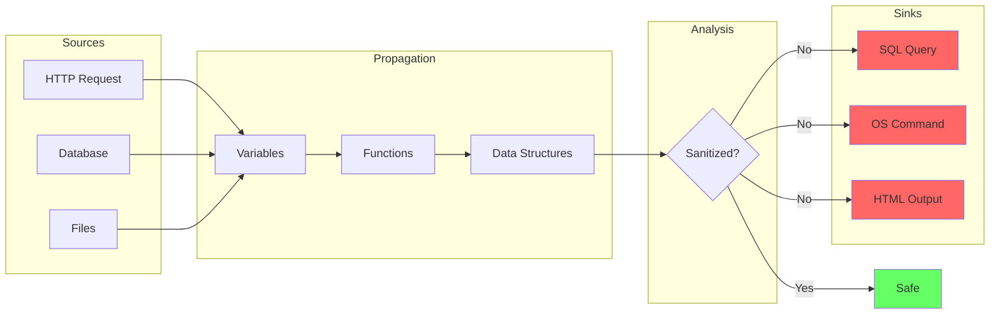

# Theory

Understanding the theoretical foundations of taint analysis is essential for effectively using static analysis tools and interpreting their results.

## Section Overview

-   :material-school:{ .lg .middle } **Fundamentals**

    ---

    Core concepts: sources, sinks, propagation, sanitizers

    [:octicons-arrow-right-24: Taint Analysis 101](fundamentals.md)

-   :material-graph:{ .lg .middle } **Dataflow Analysis**

    ---

    How tools track data through your code

    [:octicons-arrow-right-24: Dataflow Deep Dive](dataflow.md)

-   :material-chart-bar:{ .lg .middle } **Metrics**

    ---

    Understanding Precision, Recall, and F1 Score

    [:octicons-arrow-right-24: Precision & Recall](metrics.md)

## Why Theory Matters

Understanding the theoretical basis helps you:

1. **Configure tools effectively** - Know what sources and sinks to model
2. **Interpret results accurately** - Understand why findings occur
3. **Reduce false positives** - Add appropriate sanitizers
4. **Write secure code** - Recognize dangerous patterns

## Key Concepts at a Glance

## The Security Equation

A vulnerability exists when:

$$\text{Vulnerability} = \text{Tainted Source} \xrightarrow{\text{no sanitization}} \text{Dangerous Sink}$$

Tools detect these paths by:

1. **Identifying sources** of untrusted data
2. **Tracking propagation** through the program
3. **Checking for sanitizers** along the path
4. **Alerting on unsanitized sinks**

## Reading Order

For the best learning experience:

1. Start with [Fundamentals](fundamentals.md) for core concepts
2. Continue to [Dataflow Analysis](dataflow.md) for deeper understanding
3. Read [Metrics](metrics.md) to interpret tool results

---

*Ready to dive in? Start with [Taint Analysis Fundamentals](fundamentals.md)*
