# Understanding Precision & Recall

When evaluating taint analysis tools, it's crucial to understand the metrics used to measure their effectiveness. This page explains Precision, Recall, F1 Score, and their practical implications.

## The Confusion Matrix

All metrics derive from four categories of results:

|  | Actually Vulnerable | Actually Safe |
|--|:-------------------:|:-------------:|
| **Reported as Vulnerable** | True Positive (TP) | False Positive (FP) |
| **Not Reported** | False Negative (FN) | True Negative (TN) |

### Definitions

- **True Positive (TP)**: Tool correctly identifies a real vulnerability
- **False Positive (FP)**: Tool reports a vulnerability that doesn't exist
- **False Negative (FN)**: Tool misses a real vulnerability
- **True Negative (TN)**: Tool correctly doesn't report safe code

## Core Metrics

### Precision

$$\text{Precision} = \frac{TP}{TP + FP}$$

**"Of everything reported, how much is real?"**

| Precision | Meaning |
|-----------|---------|
| 100% | Every reported issue is a real vulnerability |
| 50% | Half of reports are false alarms |
| 0% | All reports are false alarms |

**High precision** = fewer false positives = less noise for developers

### Recall (Sensitivity)

$$\text{Recall} = \frac{TP}{TP + FN}$$

**"Of all real vulnerabilities, how many did we find?"**

| Recall | Meaning |
|--------|---------|
| 100% | Found every vulnerability |
| 50% | Missed half of vulnerabilities |
| 0% | Missed all vulnerabilities |

**High recall** = fewer false negatives = more vulnerabilities caught

### F1 Score

$$F_1 = 2 \cdot \frac{Precision \cdot Recall}{Precision + Recall}$$

The **harmonic mean** of precision and recall, providing a single balanced metric.

| F1 Score | Interpretation |
|----------|----------------|
| 1.0 | Perfect (P=R=100%) |
| 0.8 | Excellent |
| 0.6 | Good |
| < 0.5 | Needs improvement |

## The Precision-Recall Trade-off

You generally can't maximize both:

```
                   HIGH RECALL
                        ↑
                        │
    Find more bugs      │      IDEAL
    More false alarms   │      (hard to achieve)
                        │
    ────────────────────┼──────────────→ HIGH PRECISION
                        │
    Miss some bugs      │      Fewer false alarms
    Clean output        │      May miss real issues
                        │
```

### Why the Trade-off Exists

**To increase recall**, tools must be more sensitive:
- Flag more patterns as suspicious
- Results in more false positives

**To increase precision**, tools must be more conservative:
- Only flag very certain issues
- May miss some real vulnerabilities

## VulnShop Benchmark Results

Our tools against VulnShop's 16 vulnerabilities:

| Tool | Precision | Recall | F1 Score |
|------|:---------:|:------:|:--------:|
| **Pysa** | 85.0% | 75.0% | 0.80 |
| **CodeQL** | 92.0% | 87.5% | 0.90 |
| **Semgrep** | 78.0% | 68.8% | 0.73 |

```mermaid
xychart-beta
    title "Tool Comparison"
    x-axis [Pysa, CodeQL, Semgrep]
    y-axis "Score (%)" 0 --> 100
    bar [85, 92, 78]
    bar [75, 87.5, 68.75]
```



## Practical Implications

### High Precision Tools

Best for: **CI/CD blocking**

```yaml
# Block PR only on high-confidence findings
- name: Security Gate
  run: semgrep --config "p/security-audit" --error
```

**Pros:**
- Developers trust the findings
- Low alert fatigue
- Suitable for automated blocking

**Cons:**
- May miss some vulnerabilities
- Requires additional manual review

### High Recall Tools

Best for: **Security audits**

```yaml
# Comprehensive scan for manual review
- name: Full Security Scan
  run: |
    codeql analyze --output=report.sarif
    # Results reviewed by security team
```

**Pros:**
- Catches more issues
- Better for compliance requirements
- Suitable for high-risk applications

**Cons:**
- More false positives to triage
- Higher review burden

### Balanced Approach

Best for: **Regular development**

```yaml
# Tiered approach
- name: Fast Scan (High Precision)
  run: semgrep --config auto  # Blocks on high confidence

- name: Deep Scan (High Recall)
  run: codeql analyze  # Creates review task
```

## Choosing the Right Balance

### Consider Your Context

| Factor | Lean Toward Precision | Lean Toward Recall |
|--------|:---------------------:|:------------------:|
| Developer velocity | ✓ | |
| Security-critical app | | ✓ |
| Limited security team | ✓ | |
| Compliance requirements | | ✓ |
| CI/CD blocking | ✓ | |
| Manual review process | | ✓ |

### Example Configurations

**Startup (Move Fast)**
```yaml
# High precision, low friction
semgrep:
  severity: ERROR  # Only critical issues
  confidence: HIGH
```

**Financial Services (Risk Averse)**
```yaml
# High recall, accept more review work
codeql:
  queries: security-extended
  plus: +security-and-quality
```

## Improving Metrics

### To Improve Precision

1. **Add sanitizers** - Model functions that make data safe
2. **Tune severity thresholds** - Only report high-confidence findings
3. **Exclude test files** - Reduce noise from test code
4. **Context-specific rules** - Avoid generic patterns

### To Improve Recall

1. **Add source models** - Don't miss entry points
2. **Add sink models** - Cover all dangerous operations
3. **Enable deep analysis** - Use inter-procedural tracking
4. **Use multiple tools** - Different tools catch different issues

## Beyond Binary Metrics

### Severity Weighting

Not all vulnerabilities are equal:

$$\text{Weighted Recall} = \frac{\sum(TP_i \cdot severity_i)}{\sum(Vuln_i \cdot severity_i)}$$

| Finding | Severity | Weight |
|---------|----------|--------|
| SQL Injection | Critical | 4 |
| XSS | High | 3 |
| Info Disclosure | Medium | 2 |
| Code Quality | Low | 1 |

### Time to Detection

How quickly are vulnerabilities found?

| Stage | Value |
|-------|-------|
| Pre-commit | Highest (immediate fix) |
| PR review | High (before merge) |
| Nightly scan | Medium (next day) |
| Production | Low (potential exploit) |

## Summary

| Metric | Question | Improve By |
|--------|----------|------------|
| **Precision** | Are reports real? | Better sanitizers, higher thresholds |
| **Recall** | Did we find them all? | More sources/sinks, deeper analysis |
| **F1** | Overall balance? | Tune both precision and recall |

---

*Now that you understand the theory, explore the [tools](../tools/index.md) in detail.*
