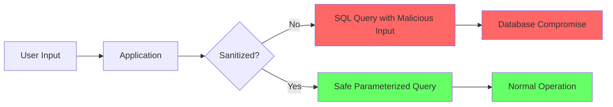

# SQL Injection

**SQL Injection (SQLi)** is a code injection technique that exploits security vulnerabilities in an application's database layer. It occurs when user input is incorrectly filtered or not properly sanitized before being included in SQL queries.

## Overview

| Attribute | Value |
|-----------|-------|
| **CWE** | [CWE-89: SQL Injection](https://cwe.mitre.org/data/definitions/89.html) |
| **OWASP** | A03:2021 - Injection |
| **Severity** | Critical (CVSS 9.8) |
| **Prevalence** | Very High |

## How It Works



### Vulnerable Code Pattern

```python
# VULNERABLE: User input directly in query
def login(request):
    username = request.POST['username']
    password = request.POST['password']

    query = f"SELECT * FROM users WHERE username = '{username}' AND password = '{password}'"
    cursor.execute(query)
```

### Attack Example

Input:
```
username: admin'--
password: anything
```

Resulting query:
```sql
SELECT * FROM users WHERE username = 'admin'--' AND password = 'anything'
```

The `--` comments out the password check, bypassing authentication.

## VulnShop Implementation

### Location 1: Authentication Bypass

**File:** `authentication/views.py:25-35`

```python
def login_view(request):
    if request.method == 'POST':
        username = request.POST.get('username')
        password = request.POST.get('password')

        # VULNERABLE: SQL Injection
        query = f"SELECT * FROM auth_user WHERE username = '{username}' AND password = '{password}'"
        with connection.cursor() as cursor:
            cursor.execute(query)
            user = cursor.fetchone()
```

**Attack URL:** `/auth/login/`

**Exploit:**
```bash
curl -X POST http://localhost:8000/auth/login/ \
  -d "username=admin'--&password=x"
```

### Location 2: Product Search

**File:** `catalog/views.py:42-52`

```python
def search_products(request):
    search_term = request.GET.get('q', '')

    # VULNERABLE: SQL Injection in search
    query = f"SELECT * FROM products WHERE name LIKE '%{search_term}%'"
    with connection.cursor() as cursor:
        cursor.execute(query)
        products = cursor.fetchall()
```

**Attack URL:** `/catalog/search/?q=`

**Exploit:**
```bash
# Extract all users
curl "http://localhost:8000/catalog/search/?q=' UNION SELECT username,password,email,1,1 FROM auth_user--"
```

## Detection by Tool

### Pysa Detection

**Rule Code:** 5001

```python
# models/django_sinks.pysa
def django.db.backends.utils.CursorWrapper.execute(
    self,
    sql: TaintSink[SQL],
    params = ...
): ...
```

**Finding:**
```json
{
  "code": 5001,
  "message": "User-controlled data flows to SQL query",
  "filename": "authentication/views.py",
  "line": 32
}
```

### CodeQL Detection

**Query:** `sql-injection.ql`

```ql
class SqlInjectionConfig extends TaintTracking::Configuration {
  override predicate isSource(DataFlow::Node source) {
    source instanceof RemoteFlowSource
  }

  override predicate isSink(DataFlow::Node sink) {
    exists(Call call |
      call.getFunc().(Attribute).getName() = "execute" and
      sink.asExpr() = call.getArg(0)
    )
  }
}
```

### Semgrep Detection

**Rule:** `sql-injection.yml`

```yaml
rules:
  - id: sql-injection-format-string
    pattern-either:
      - pattern: $CURSOR.execute(f"...{$INPUT}...")
      - pattern: $CURSOR.execute("...".format(...))
      - pattern: $CURSOR.execute("..." % $INPUT)
    message: SQL injection via string formatting
    severity: ERROR
    languages: [python]
```

## Remediation

### 1. Parameterized Queries (Recommended)

```python
def login_view(request):
    username = request.POST.get('username')
    password = request.POST.get('password')

    # SAFE: Parameterized query
    query = "SELECT * FROM auth_user WHERE username = %s AND password = %s"
    with connection.cursor() as cursor:
        cursor.execute(query, [username, password])
        user = cursor.fetchone()
```

### 2. Django ORM (Preferred)

```python
from django.contrib.auth.models import User
from django.contrib.auth import authenticate

def login_view(request):
    username = request.POST.get('username')
    password = request.POST.get('password')

    # SAFE: Django ORM handles escaping
    user = authenticate(username=username, password=password)
```

### 3. Input Validation

```python
import re

def login_view(request):
    username = request.POST.get('username')

    # Validate input format
    if not re.match(r'^[a-zA-Z0-9_]{3,20}$', username):
        return HttpResponse("Invalid username format", status=400)

    # Then use parameterized query
    ...
```

## Detection Comparison

| Tool | Detected | Method | False Positives |
|------|:--------:|--------|-----------------|
| Pysa | ✅ | Taint tracking | Low |
| CodeQL | ✅ | Dataflow analysis | Low |
| Semgrep | ✅ | Pattern + Taint | Medium |

### Detection Trace (Pysa)

```
Source: request.POST.get('username')
  ↓ [assignment]
Variable: username
  ↓ [format-string]
String: f"SELECT * FROM auth_user WHERE username = '{username}'..."
  ↓ [parameter]
Sink: cursor.execute(query)
```

## Advanced Attack Techniques

### Union-Based Injection

```sql
' UNION SELECT 1,2,3,username,password FROM users--
```

### Blind SQL Injection

```sql
' AND (SELECT SUBSTRING(password,1,1) FROM users WHERE username='admin')='a'--
```

### Time-Based Blind

```sql
' AND (SELECT SLEEP(5) FROM users WHERE username='admin')--
```

### Second-Order Injection

```python
# Stage 1: Store malicious data
INSERT INTO users (username) VALUES ('admin''--')

# Stage 2: Later use triggers injection
SELECT * FROM logs WHERE user = (SELECT username FROM users WHERE id = 1)
```

## Testing Checklist

- [ ] Authentication forms
- [ ] Search functionality
- [ ] Sort/filter parameters
- [ ] ID parameters (user_id, order_id)
- [ ] URL path parameters
- [ ] JSON/API inputs
- [ ] Cookie values
- [ ] HTTP headers

## References

- [OWASP SQL Injection](https://owasp.org/www-community/attacks/SQL_Injection)
- [CWE-89](https://cwe.mitre.org/data/definitions/89.html)
- [PortSwigger SQL Injection](https://portswigger.net/web-security/sql-injection)
- [Django Security: SQL Injection](https://docs.djangoproject.com/en/4.2/topics/security/#sql-injection-protection)
