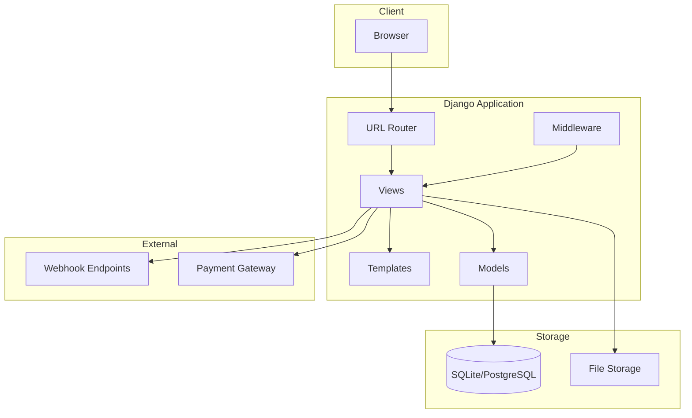

# VulnShop Architecture

## System Architecture



## Module Structure

```
vulnerable-app/
├── vulnshop/           # Main project
│   ├── settings.py     # Configuration
│   ├── urls.py         # Root URL config
│   └── wsgi.py         # WSGI entry point
├── authentication/     # Auth module
├── catalog/            # Products
├── cart/               # Shopping cart
├── payment/            # Payments
├── reviews/            # Product reviews
├── profile/            # User profiles
├── admin_panel/        # Admin tools
├── webhooks/           # Integrations
├── notifications/      # Alerts
├── api/                # REST API
└── middleware/         # Custom middleware
```

## Data Flow

### User Authentication
```
Request → views.login_view → SQL Query → Response
                ↓
         (SQL Injection vulnerability)
```

### Product Search
```
Request → views.search → SQL Query → Template → Response
                ↓              ↓
          (SQL Injection)   (XSS)
```

### Admin Diagnostics
```
Request → views.diagnostics → os.system → Response
                    ↓
            (Command Injection)
```

## Database Schema

### Core Models

```python
class User:
    username: str
    email: str
    password: str (hashed)

class Product:
    name: str
    description: str
    price: Decimal
    category: ForeignKey

class Order:
    user: ForeignKey
    total: Decimal
    status: str

class Review:
    product: ForeignKey
    user: ForeignKey
    content: str  # Stored XSS
    rating: int
```

## Security Boundaries

| Boundary | Protection | Vulnerability |
|----------|------------|---------------|
| User Input | None | SQL/XSS/Command Injection |
| File Access | None | Path Traversal |
| External Requests | None | SSRF |
| Serialization | None | Deserialization |
| Templates | Disabled | SSTI |
