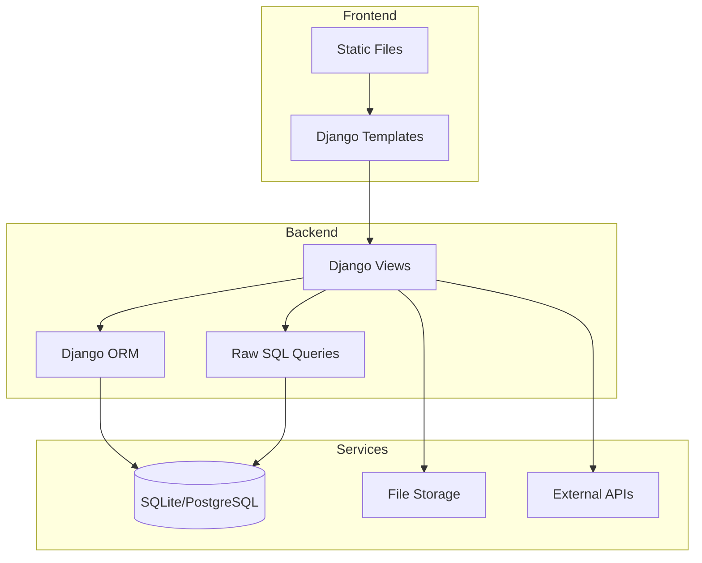

# VulnShop

**VulnShop** is a deliberately vulnerable e-commerce application built with Django. It serves as a realistic target for learning and testing taint analysis tools.

## Overview

VulnShop simulates a full-featured online store with:

- User authentication and profiles
- Product catalog with search
- Shopping cart and checkout
- Reviews and ratings
- Admin panel
- Webhook integrations
- API endpoints

Each feature contains intentional security vulnerabilities for educational purposes.

!!! danger "Security Warning"
    VulnShop contains real, exploitable vulnerabilities. **Never expose it to the internet** or use it in production environments.

## Architecture



## Project Structure

```
vulnerable-app/
├── vulnshop/               # Main Django project
│   ├── settings.py         # Configuration (contains secrets)
│   ├── urls.py             # URL routing
│   └── wsgi.py             # WSGI application
├── authentication/         # User authentication
│   ├── views.py            # Login, registration (SQL injection)
│   └── models.py           # User model
├── catalog/                # Product catalog
│   ├── views.py            # Search, list, detail (SQLi, XSS, Path traversal)
│   └── models.py           # Product, Category models
├── reviews/                # Product reviews
│   ├── views.py            # Submit, display (Stored XSS)
│   └── models.py           # Review model
├── cart/                   # Shopping cart
│   ├── views.py            # Add, remove, checkout
│   └── models.py           # Cart, CartItem models
├── payment/                # Payment processing
│   ├── views.py            # Process payment (IDOR)
│   └── models.py           # Order, Payment models
├── profile/                # User profiles
│   ├── views.py            # View, edit (Deserialization)
│   └── models.py           # Profile model
├── admin_panel/            # Admin functionality
│   ├── views.py            # Diagnostics (Command injection)
│   └── models.py           # Admin models
├── webhooks/               # Webhook integration
│   ├── views.py            # Test webhook (SSRF)
│   └── models.py           # Webhook model
├── notifications/          # Notification system
│   ├── views.py            # Preview (SSTI)
│   └── models.py           # Notification model
├── api/                    # REST API
│   ├── views.py            # Import/export (XXE)
│   └── serializers.py      # API serializers
├── middleware/             # Custom middleware
│   └── security.py         # Vulnerable middleware
├── templates/              # HTML templates
├── static/                 # CSS, JS, images
└── manage.py               # Django management
```

## Vulnerability Map

| Module | Vulnerability | File:Line | OWASP |
|--------|---------------|-----------|-------|
| authentication | SQL Injection | views.py:25 | A03 |
| catalog | SQL Injection | views.py:42 | A03 |
| catalog | Reflected XSS | views.py:60 | A03 |
| catalog | Path Traversal | views.py:85 | A01 |
| reviews | Stored XSS | views.py:20 | A03 |
| admin_panel | Command Injection | views.py:55 | A03 |
| webhooks | SSRF | views.py:15 | A10 |
| profile | Insecure Deserialization | views.py:45 | A08 |
| notifications | SSTI | views.py:25 | A03 |
| api | XXE | views.py:50 | A05 |
| payment | IDOR | views.py:30 | A01 |
| vulnshop | Hardcoded Secrets | settings.py:23 | A02 |
| middleware | Sensitive Logging | security.py:15 | A09 |

## Running VulnShop

### With Docker (Recommended)

```bash
docker-compose up -d
```

Access at: [http://localhost:8000](http://localhost:8000)

### Without Docker

```bash
cd vulnerable-app
pip install -r requirements.txt
python manage.py migrate
python manage.py loaddata fixtures/initial_data.json
python manage.py runserver 0.0.0.0:8000
```

## Default Credentials

| User | Password | Role |
|------|----------|------|
| admin | admin123 | Administrator |
| john | user123 | Regular user |
| jane | user123 | Regular user |

## Exploitation Guide

### 1. SQL Injection - Authentication Bypass

**URL:** `/auth/login/`

**Payload:**
```
Username: admin'--
Password: anything
```

**Result:** Logged in as admin without password.

### 2. Command Injection - Server Compromise

**URL:** `/admin-panel/diagnostics/`

**Payload:**
```
Hostname: localhost; cat /etc/passwd
Action: ping
```

**Result:** Executes arbitrary system commands.

### 3. SSRF - Internal Network Access

**URL:** `/webhooks/test/`

**Payload:**
```
URL: http://169.254.169.254/latest/meta-data/
```

**Result:** Access cloud metadata or internal services.

### 4. XSS - Session Hijacking

**URL:** `/catalog/search/?q=<script>alert(document.cookie)</script>`

**Result:** JavaScript executes in victim's browser.

## Testing with Analysis Tools

### Semgrep

```bash
cd analysis/semgrep
semgrep --config rules/ ../../vulnerable-app/
```

### Pysa

```bash
cd analysis/pysa
./scripts/run_pysa.sh
```

### CodeQL

```bash
cd analysis/codeql
./scripts/run_analysis.sh
```

## Module Documentation

<div class="grid cards" markdown>

-   :material-map:{ .lg .middle } **Vulnerability Map**

    ---

    Complete mapping of all vulnerabilities

    [:octicons-arrow-right-24: Vulnerability Map](vulnerability-map.md)

-   :material-layers:{ .lg .middle } **Architecture**

    ---

    Technical architecture details

    [:octicons-arrow-right-24: Architecture](architecture.md)

-   :material-bug:{ .lg .middle } **Exploitation Guide**

    ---

    Step-by-step exploitation tutorials

    [:octicons-arrow-right-24: Exploitation](exploitation.md)

</div>

## Educational Use

VulnShop is designed for:

1. **Learning taint analysis** - See how tools detect real vulnerabilities
2. **Security training** - Practice exploitation in a safe environment
3. **Tool evaluation** - Compare detection capabilities
4. **Research** - Develop new detection techniques

## Contributing

Found a bug in VulnShop? (An unintentional one!) Please report it via GitHub issues.

Want to add more vulnerabilities? PRs welcome with:

- Clear documentation of the vulnerability
- Expected tool detection results
- Safe default state (vulnerability should be obvious)
